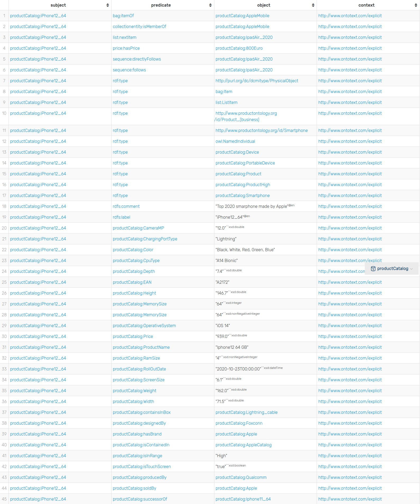

# Visualizzazione

## Tassonomia delle classi

## Template utilizzati per i dati (GraphDB)

TODO

## Triple di esempio

Si sono voluti selezionare due esempi (rispettivamente *productCatalog:Apple* e *productCatalog:iPhone12_X*)
per mostrare alcune delle triple più utilizzate nel progetto per descrivere istanze dell'ontologia

Sono state incluse, come si può notare, anche le inferenze, che tramite GraphDB vengono 
esplicitate qui in tabella.

Per quanto riguarda la colonna del contesto, è stata riportata ma il contesto accluso
è quello di default dell'applicazione.

